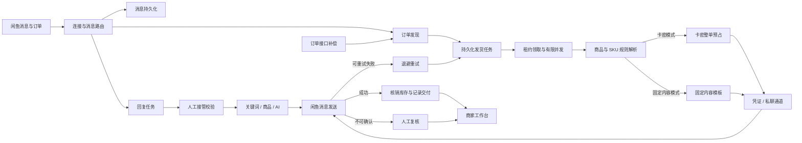

# XianYuSmart

[English](README.en.md) | **简体中文**

[](https://github.com/Evvvvvvvan/XianYuSmart/stargazers)
[](https://github.com/Evvvvvvvan/XianYuSmart/forks)
[](https://github.com/Evvvvvvvan/XianYuSmart/releases/latest)
[](#star-history)
[](https://www.oracle.com/java/technologies/downloads/#java21)
[](https://spring.io/projects/spring-boot)
[](https://vuejs.org/)
[](https://www.mysql.com/)
[](LICENSE)

> **让虚拟商品从下单、交付、答疑到评价尽量自动完成；正常订单无需盯守，异常订单集中处理。**

XianYuSmart 是一个面向多租户场景的闲鱼虚拟商品运营系统。买家下单后，平台可以按商品自动交付固定资源或卡密，通过发货凭证、私聊或两种通道完成触达；成交前后的常见咨询、收货引导和评价跟进也能按规则自动处理。商家只需关注低库存、账号掉线、发送失败和待复核等真正需要介入的事项。

它不只是在收到订单后发送一段文本，而是把 **订单发现、幂等入队、库存预占、双通道交付、失败重试和人工复核** 串成可恢复的完整链路。固定内容与卡密两种交付模式严格互斥，账号、商品、消息、订单、库存、任务和 AI 知识库按租户隔离。核心任务链路只依赖 MySQL，不强制引入 Redis 或消息队列，兼顾部署成本与后续扩展。

当前版本：0.0.1 · [查看更新日志](CHANGELOG.md)

[交流与支持](#交流与支持) · [商家能得到什么](#商家能得到什么) · [技术亮点](#技术亮点) · [解决的问题](#解决的问题) · [能力范围](#能力范围) · [功能入口与使用顺序](#功能入口与使用顺序) · [业务流程](#业务流程) · [技术基线](#技术基线) · [镜像部署](#镜像部署) · [快速启动](#快速启动) · [配置说明](#配置说明) · [开发构建](#开发构建) · [构建与验证](#构建与验证) · [目录与职责](#目录与职责) · [日常运维](#日常运维) · [使用边界](#使用边界) · [许可证与免责声明](#许可证与免责声明) · [Star History](#star-history)

## 交流与支持

真实使用中的问题、经验和建议，会让 XianYuSmart 变得更稳定、更好用。欢迎加入微信群聊交流部署配置、连接排查、自动发货和运营实践；如果项目确实节省了时间或解决了经营中的实际问题，也欢迎自愿赞赏，支持项目持续维护。

<table>
  <tr>
    <td width="50%" align="center" valign="top">
      <strong>加入微信群聊</strong>
      <p>与开发者和实际使用者交流配置、排错与使用经验，及时了解项目进展。欢迎提出需求、分享实践，也欢迎参与项目共建。</p>
      
      <p><sub>二维码具有时效性，失效后将在仓库更新</sub></p>
    </td>
    <td width="50%" align="center" valign="top">
      <strong>赞赏项目</strong>
      <p>每一份支持都会转化为文档完善、兼容性验证、问题修复和持续维护的动力。金额不论多少，都是对项目继续向前的鼓励。</p>
      
      <p><sub>赞赏完全自愿，不对应商业服务、功能优先权或任何承诺</sub></p>
    </td>
  </tr>
</table>

## 商家能得到什么

| 使用场景 | XianYuSmart 自动完成 | 直接效果 |
| --- | --- | --- |
| 出售网盘链接、教程或固定资源 | 复用固定内容模板，自动替换会员名称、订单号和发货内容 | 不需要为每笔订单重复复制粘贴 |
| 出售激活码、兑换码或会员卡 | 按订单数量预占卡密，交付成功后核销并记录去向 | 降低重复发卡、少发和库存对不上的概率 |
| 卡密由已有供货系统提供 | 按订单实时调用 HTTPS 接口，使用幂等键避免重复采购，不确定结果转人工核对 | 不需要提前搬运全部库存，也不会因超时盲目重复扣货 |
| 买家需要及时收到内容 | 发货凭证与私聊通道可以单独开启，也可以同时发送 | 买家更容易找到交付内容，减少重复询问 |
| 大量重复咨询占用时间 | 按关键词、商品专属规则或 AI 知识库回复，支持人工接管 | 常见问题自动处理，复杂会话仍可人工继续 |
| 买家确认收货后需要跟进 | 按顺序发送自定义收货话术，并根据配置执行评价 | 售后引导形成固定流程，不依赖人工记忆 |
| 多商品需要统一维护 | 固定模板、卡密仓库、评价文案池和批量规则集中复用 | 减少重复配置，修改一次即可用于多个商品 |
| 服务重启、网络抖动或接口失败 | 自动恢复持久化任务，按退避策略重试，结果不确定时转人工复核 | 异常不会静默丢失，也不会盲目重复发送 |
| 多商家共同使用同一平台 | 业务数据和 AI 知识库按租户隔离 | 每个商家只管理自己的账号、商品、订单和配置 |
| 需要识别老客或暂停风险买家自动化 | 自动沉淀买家互动和成交数据，可维护标签、备注与自动化暂停状态 | 客户关系更清晰，异常买家不会继续触发自动回复或自动发货 |
| 关键异常需要及时触达 | 账号离线、凭证失效、发货异常和低库存通过 Webhook 通知并保留发送记录 | 不必持续盯着后台，也能及时发现需要介入的事项 |

对买家而言，核心体验是 **下单后更快收到内容、交付入口更清晰、常见问题更快得到回复**；对商家而言，核心变化是从“逐单操作”转为“配置规则、处理异常、查看结果”。

## 技术亮点

| 工程设计 | 实现方式 | 带来的价值 |
| --- | --- | --- |
| 原子卡密交付 | MySQL 行级锁整单预占，发送成功后核销，失败释放或转人工复核 | 避免并发订单导致重复发卡、少发和超卖 |
| 可恢复任务队列 | 订单与回复任务持久化，使用 Worker 租约、超时回收和退避重试 | 进程退出或服务器重启后仍能继续处理 |
| 双入口幂等 | WebSocket 实时事件与订单接口补偿统一按订单号入队 | 实时性与完整性兼顾，同一订单不会重复交付 |
| 多租户数据边界 | `TenantContext`、租户字段、联合唯一索引与数据库迁移共同约束 | 账号、订单、库存、配置和知识库互不串数据 |
| 实时消息链路 | Java-WebSocket 接入，MessagePack 解码，消息持久化与业务处理异步解耦 | 长连接接收不被耗时业务阻塞 |
| AI 客服可隔离 | Spring AI、租户级动态客户端与独立向量库，支持关键词、商品规则和人工接管 | AI 能力可按租户配置，也能随时回到确定性规则 |
| 轻量运行边界 | 有界线程池、有限任务队列、批量领取和数据库连接池上限 | 不依赖重型中间件也能控制资源占用 |
| 策略化扩展 | 固定内容/卡密交付策略与关键词/AI 回复策略独立解析 | 新增交付或回复方式时无需改写主流程 |
| 外部供货幂等 | 订单级请求令牌、响应数量校验和不确定结果隔离 | 对接外部卡密系统时避免重复采购与错误交付 |
| 主动通知与诊断 | 多渠道通知、签名校验、SSRF 防护、统一异常视图与处理状态 | 关键事件可及时触达，已处理的历史异常不会持续干扰 |

这套实现适合研究 **可靠任务调度、事件驱动自动化、多租户数据隔离、虚拟库存一致性和 AI 客服编排**。仓库提供的是从前端工作台、后端状态机、数据库迁移到容器部署的完整闭环，而不是只能运行单一路径的代码片段。

> 如果这些工程问题也是关注重点，欢迎 Star 关注项目演进；需要定制交付或回复链路时，可以 Fork 后沿现有策略接口扩展。

## 解决的问题

| 经营问题 | 处理方式 |
| --- | --- |
| 卡密重复发送、少发或超卖 | MySQL 行级锁、整单预占、发送成功后核销、失败释放或转人工复核 |
| 服务重启后订单或回复丢失 | 发货任务与回复任务持久化，租约超时后自动恢复 |
| 多入口同时触发重复发货 | 订单号幂等入队，WebSocket 与接口发现统一进入任务队列 |
| 消息高峰占用失控 | 共用有界线程池、有限队列、批量领取和连接池上限 |
| 客服自动化误回复 | 人工接管状态持久化，关键词、商品回复和 AI 回复按结果统一判定 |
| 库存与失败情况发现太晚 | 首页集中显示可用卡密、低库存、待处理、需复核和失败任务 |
| 多商家数据相互影响 | 账号、商品、消息、订单、卡密、设置、任务和AI知识库按租户隔离 |
| 商品发布与分销链路割裂 | 货源采集、选品入库、素材管理、批量发布、删除和补偿任务统一编排 |
| 评价与擦亮依赖人工巡检 | 商品管理统一维护评价开关、触发方式和文案池，支持批量应用；订单页处理手动评价和双方评价，擦亮按自然日去重 |
| 公网访问边界不清晰 | 应用仅绑定本机端口，Nginx 提供 HTTPS、限流和反向代理 |
| 买家信息散落在消息与订单中 | 自动建立买家资料，汇总互动、订单、成交金额、标签和运营备注 |
| 外部供货接口超时后无法判断是否扣货 | 使用固定幂等键重试，网络结果不确定时锁定订单并进入人工核对 |

## 能力范围

| 经营自动化 | 可靠交付 | 多租户运维 |
| --- | --- | --- |
| 账号、Cookie、连接与掉线提醒 | 多数量卡密原子预占与幂等交付 | MySQL 自动建表和版本迁移 |
| 商品、SKU、发货规则与卡密仓库 | 发货任务重试、租约恢复与人工复核 | Docker Compose、健康检查与 HTTPS 代理 |
| 固定内容与卡密严格二选一，凭证与私聊通道可独立启用 | 人工接管与延迟回复恢复 | 业务数据备份与操作日志 |
| 关键词、商品配置与 AI 自动回复 | 消息、订单和发货结果全程留痕 | 默认排除 Cookie、API Key、邮箱密码等敏感值 |
| 收入、交付、回复、库存与异常工作台 | 失败任务集中待办 | 有界线程池、连接池与批量调度参数 |
| 素材、地址、货源、选品和发布规则 | 自动/手动评价、自定义文案、自动擦亮与订单状态跟踪 | 租户级AI客户端、配置与向量库 |
| 返佣账号、分销结算与补偿任务 | 发布ID回写、短链修复和卡券绑定 | 公告、反馈、风控事件与操作日志 |
| 买家标签、备注与风险自动化暂停 | 本地库存与外部接口卡密供货 | Webhook 通知、发送日志与系统诊断 |

## 功能入口与使用顺序

同一项自动化能力只在一个业务模块维护开关和模板，其他页面仅展示状态、执行结果或提供跳转，避免多处配置互相覆盖。

| 唯一配置入口 | 负责内容 |
| --- | --- |
| 连接管理 | Cookie 更新、连接状态、WebSocket 重连和账号健康检查 |
| 商品管理 | 商品同步与编辑、自动评价规则、评价文案池、批量应用和自动擦亮 |
| 固定内容模板 | 下载链接、使用说明等可复用固定发货内容及变量模板 |
| 卡密仓库 | 本地卡密库存、外部供货接口、批量导入、库存预警和使用记录 |
| 自动发货 | 为商品选择固定内容或卡密模式，设置总开关、凭证发送和私聊发送 |
| 自动回复 | 关键词、商品专属回复、AI 回复和人工接管设置 |
| 买家管理 | 查看买家互动、订单和成交数据，维护标签、备注与自动化暂停状态 |
| 订单与评价 | 查看履约状态、手动评价、双方评价和失败重试，不维护自动评价规则 |
| 通知与诊断 | 检查账号、发货、回复和库存异常，单条或批量标记已处理，配置通知渠道与查看发送记录 |
| 操作日志与系统设置 | 查询业务操作、异常原因和租户级系统参数 |

推荐配置顺序：

1. 在连接管理添加闲鱼账号，确认 Cookie 有效且 WebSocket 已连接。
2. 同步商品；固定资源先创建固定内容模板，卡密商品先建立卡密仓库并导入库存。
3. 在自动发货中为商品二选一配置发货模式，再按需开启凭证和私聊通道。
4. 在自动回复中配置关键词、商品回复或 AI 回复策略。
5. 在商品管理统一设置自动评价模式与文案，按需开启自动擦亮。
6. 在订单与评价、操作日志和首页待办中检查执行结果与异常任务。

## 业务流程



### 商品运营闭环

`商品采集 -> 选品规则 -> 素材库 -> 单品或批量发布 -> 商品ID回写 -> 自动擦亮/评价 -> 分销结算`

- 发布规则和删除规则按租户定时生成持久化任务，失败后按退避时间重试。
- 补偿任务统一处理发布商品 ID 回写、站内短链修复和卡券仓库绑定。
- 公告、反馈、风控事件与任务结果统一进入运营中心，便于按租户追踪。
- 首页提供快速上手与核心功能直达入口；运营中心提供使用向导、模块说明、必填校验和下一步提示；自动评价规则统一在商品管理维护，订单页仅处理手动评价和双方评价结果。

### 发货状态

`PENDING -> PROCESSING -> SUCCESS`

- 临时网络或接口失败：`PROCESSING -> RETRY -> PENDING`
- 超过重试上限或发送结果不确定：`PROCESSING -> REVIEW_REQUIRED`
- 进程异常退出：租约过期后重新领取

### 卡密状态

`AVAILABLE -> RESERVED -> USED`

- 只有库存数量完整满足订单数量时才会预占。
- 消息确认发送成功后才会核销为 `USED`。
- 明确发送失败时释放为 `AVAILABLE`。
- 发送结果无法确认时保留关联并进入人工复核，避免重复发送。

## 技术基线

- Java 21
- Spring Boot 3.5
- MySQL 5.7+
- Flyway
- MyBatis-Plus
- Vue 3、TypeScript、Vite
- Docker Compose
- Nginx

## 镜像部署

每个正式 Release 会自动发布 `linux/amd64` 镜像到 GitHub Container Registry。固定版本适合生产部署，`latest` 适合体验最新正式版本。

```bash
docker pull ghcr.io/evvvvvvvan/xianyusmart:v0.0.1
docker pull ghcr.io/evvvvvvvan/xianyusmart:latest
```

使用仓库内的 Docker Compose 启动固定版本：

Linux：

```bash
cp .env.example .env
# 修改 .env 中的数据库密码和 JWT 强密钥
export APP_IMAGE=ghcr.io/evvvvvvvan/xianyusmart:v0.0.1
docker compose pull app
docker compose up -d --no-build
```

Windows PowerShell：

```powershell
Copy-Item .env.example .env
notepad .env
$env:APP_IMAGE = 'ghcr.io/evvvvvvvan/xianyusmart:v0.0.1'
docker compose pull app
docker compose up -d --no-build
```

镜像启动仍依赖 `.env` 中的 MySQL、JWT 和跨域配置。Windows Docker Desktop 需要使用 Linux 容器模式。生产环境建议固定版本标签，避免 `latest` 更新带来未计划的版本变化。

## 快速启动

### 环境要求

- Docker Engine 24+ 或 Docker Desktop
- Docker Compose v2
- Linux 生产环境建议 2 核、2 GB 内存起步
- Windows 可使用 Docker Desktop 完成功能测试

### Linux

```bash
chmod +x install.sh
./install.sh
```

### Windows PowerShell

```powershell
Copy-Item .env.example .env
notepad .env
docker compose up -d --build
docker compose ps
```

启动前必须修改 `.env` 中的三个示例密钥。`JWT_SECRET` 至少使用 32 个随机字节，数据库密码不得复用。

启动后访问：`http://localhost:12400`

全新数据库首次访问会进入租户账号创建页；已有租户时可从登录页继续注册新租户，密码长度限制为 8 至 72 位。

### 公网 HTTPS

1. 将证书保存为：

```text
deploy/nginx/certs/fullchain.pem
deploy/nginx/certs/privkey.pem
```

2. 修改 `.env`：

```dotenv
ALLOWED_ORIGINS=https://shop.example.com
TRUST_PROXY=true
```

3. 启动代理配置：

```bash
docker compose --profile proxy up -d --build
```

4. 域名解析到服务器后访问 `https://shop.example.com`。

应用容器只映射 `127.0.0.1:12400`，公网流量统一经过 Nginx。生产环境不得直接开放 MySQL 和 12400 端口。

## 配置说明

复制 `.env.example` 为 `.env` 后按环境修改：

| 变量 | 说明 | 推荐值 |
| --- | --- | --- |
| `DB_NAME` | MySQL 数据库名 | `xianyusmart` |
| `DB_USERNAME` | 业务数据库账号 | 独立低权限账号 |
| `DB_PASSWORD` | 业务数据库密码 | 随机强密码 |
| `DB_ROOT_PASSWORD` | MySQL root 密码 | 与业务密码不同 |
| `JWT_SECRET` | 登录令牌签名密钥 | 48 字节以上随机值 |
| `ALLOWED_ORIGINS` | 允许访问的前端来源 | 完整 HTTPS 域名 |
| `TRUST_PROXY` | 是否信任代理头 | 仅 Nginx 部署设为 `true` |
| `UPDATE_RELEASE_API` | GitHub 发行版 API | 默认使用本项目最新 Release，留空可关闭更新检查 |
| `DB_POOL_MAX_SIZE` | 最大数据库连接数 | 单实例默认 `10` |
| `DB_POOL_MIN_IDLE` | 最小空闲连接数 | 默认 `2` |
| `JAVA_OPTS` | JVM 容器内存策略 | 默认值适合小型实例 |

可在 `compose.yaml` 的 `app.environment` 中补充以下调优变量：

| 变量 | 默认值 | 作用 |
| --- | ---: | --- |
| `EXECUTOR_CORE_SIZE` | 4 | 通用业务线程数 |
| `EXECUTOR_MAX_SIZE` | 8 | 通用业务最大线程数 |
| `EXECUTOR_QUEUE_CAPACITY` | 500 | 有界任务队列容量 |
| `DELIVERY_CLAIM_BATCH_SIZE` | 20 | 单轮领取发货任务数 |
| `DELIVERY_DISPATCH_DELAY_MS` | 1000 | 发货调度间隔 |
| `DELIVERY_LEASE_SECONDS` | 120 | 任务处理租约 |
| `DELIVERY_MAX_ATTEMPTS` | 3 | 最大发货尝试次数 |
| `PRINT_RAW_MESSAGE` | false | 原始消息日志开关，生产环境保持关闭 |

调大并发前应同步评估闲鱼接口频率、活跃租户数、MySQL 连接数和服务器内存。优先保持默认值，通过异常待办确认实际瓶颈后再调整。

## 开发构建

### Windows 本地开发

准备 Java 21、Node.js 20+、MySQL 5.7+，然后创建数据库和账号：

```sql
CREATE DATABASE xianyusmart CHARACTER SET utf8mb4 COLLATE utf8mb4_unicode_ci;
CREATE USER 'xianyusmart'@'localhost' IDENTIFIED BY 'replace-with-strong-password';
GRANT ALL PRIVILEGES ON xianyusmart.* TO 'xianyusmart'@'localhost';
FLUSH PRIVILEGES;
```

后端：

```powershell
$env:DB_PASSWORD = 'replace-with-strong-password'
$env:JWT_SECRET = 'replace-with-at-least-32-random-bytes'
.\mvnw.cmd spring-boot:run
```

前端：

```powershell
Set-Location vue-code
npm ci
npm run dev
```

前端开发地址为 `http://localhost:5173`，接口自动代理到 `http://localhost:12400`。

## 构建与验证

```powershell
Set-Location vue-code
npm ci
npm run type-check
npm run build:spring
Set-Location ..
.\mvnw.cmd clean test
.\mvnw.cmd clean package
```

Linux 将 `mvnw.cmd` 替换为 `./mvnw`。

## 目录与职责

```text
src/main/java/com/xianyusmart/
├─ controller/          HTTP 接口与工作台聚合
├─ service/             账号、消息、回复、发货、运营编排和持久化任务
├─ service/delivery/    文本与卡密交付策略
├─ websocket/           闲鱼长连接、路由和重连
├─ mapper/              MySQL 数据访问与任务锁定
├─ interceptor/         登录认证边界
├─ backup/              可选择的数据备份
└─ config/              线程池、Web、数据库与 AI 配置

src/main/resources/
├─ db/migration/        Flyway 数据库结构
├─ static/              已构建的 Vue 前端
└─ application.yaml     运行参数

vue-code/src/
├─ api/                 前端接口封装
├─ components/          共用组件与布局
├─ views/               商家业务页面
├─ utils/               请求、提示与确认工具
└─ assets/              简约商业主题

deploy/nginx/            HTTPS、限流和反向代理
compose.yaml             应用、MySQL、Nginx 编排
```

## 日常运维

查看状态与日志：

```bash
docker compose ps
docker compose logs -f --tail=200 app
docker compose logs -f --tail=200 mysql
```

更新本地代码后：

```bash
docker compose up -d --build
```

备份 MySQL：

```bash
docker compose exec mysql mysqldump -uxianyusmart -p xianyusmart > xianyusmart.sql
```

恢复前应先停止应用写入并验证备份文件。业务数据导出不包含 Cookie、AI Key、邮箱密码等敏感配置，灾备流程需单独保存运行环境变量和证书。

## 使用边界

- 闲鱼接口、Cookie 和风控策略可能变化，账号状态与异常待办需要持续关注。
- 自动化频率应符合平台规则，不应用于欺诈、骚扰或绕过平台安全机制。
- 公网部署必须启用 HTTPS、强密码、主机防火墙和定期备份。
- 全新环境使用 MySQL，不提供 SQLite 历史数据自动迁移。

## 许可证与免责声明

本项目采用 [PolyForm Noncommercial License 1.0.0](LICENSE)，仅授权个人学习、技术研究、实验和其他非商业用途。

**禁止任何商业用途**，包括销售、收费部署、托管服务、SaaS、代运营、商业获客、收费培训，以及通过广告、订阅、佣金或增值服务直接或间接获利。

- 使用行为必须遵守法律法规、闲鱼平台服务协议和账号使用规则。

下载、复制、修改、部署、运行或分发本项目，即表示已阅读并接受 [完整使用限制与免责声明](DISCLAIMER.md)。

## ⭐ Star History

<a href="docs/assets/star-history-light.png">
  <picture>
    <source media="(prefers-color-scheme: dark)" srcset="docs/assets/star-history-dark.png" />
    <source media="(prefers-color-scheme: light)" srcset="docs/assets/star-history-light.png" />
    
  </picture>
</a>
<sub>由 <a href="scripts/gen_star_history.py"><code>scripts/gen_star_history.py</code></a> 生成，<a href=".github/workflows/star-history.yml">GitHub Actions</a> 每日自动更新 · 点击图片查看大图</sub>
